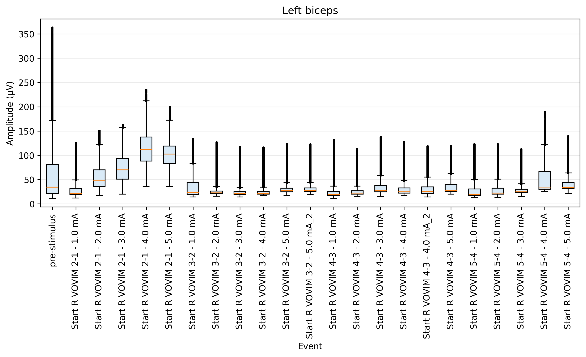

# EDF+ Analysis GUI for Cadwell Arc Exports

Interactive Python/Tkinter GUI for reviewing and analyzing EDF+ files exported from **Cadwell's Arc software**. The tool is designed for neurophysiology signal review workflows where an EDF+ file contains signal channels and annotation/event markers.

The main output is a box-and-whisker plot comparing a selected baseline/pre-stimulus window with one or more event-locked stimulation windows.



## Repository contents

- `analyze_edf_gui.py` - main GUI application.
- `requirements.txt` - Python package dependencies.
- `data/sample_output.png` - sample PNG output from the analysis workflow.

## Requirements

### Python

- Python **3.10 or newer** is recommended.

### Python packages

Install the required Python packages with:

```bash
pip install -r requirements.txt
```

The required packages are:

- `numpy` - numerical array processing.
- `matplotlib` - signal previews and box-whisker plots.
- `mne` - EDF/EDF+ loading, channel metadata, annotations, cropping, and filtering.
- `scipy` - numerical/scientific backend used by MNE filtering routines.

### Tkinter GUI support

The GUI uses Python's standard `tkinter` module. On many systems it is included with Python. On some Linux systems you may need to install it separately, for example:

```bash
sudo apt-get install python3-tk
```

## Running the GUI

From the repository directory:

```bash
python analyze_edf_gui.py
```

The program opens a file picker. Select an EDF+ file exported from Cadwell Arc.

## Intended EDF+ input

This code was developed for analyzing **EDF+ files exported from Cadwell's Arc software**. It expects:

1. One or more physiological signal channels.
2. EDF+/Cadwell annotation markers that can be used as baseline and stimulation/event anchors.
3. Sampling metadata readable by MNE.

## Basic workflow

1. Select an EDF+ file.
2. Choose the channel of interest.
3. Set the bandpass filter limits.
4. Choose the analysis mode:
   - baseline and stimulation,
   - baseline only, or
   - stimulation only.
5. Select the baseline annotation and baseline time window.
6. Select one or more stimulation/event annotations and the event time window.
7. Set the RMS smoothing window in milliseconds.
8. Optionally enter a custom plot title.
9. Run final signal analysis and save the PNG output.

## How raw signal is processed for the box-whisker plots

For each selected baseline or event annotation, the program processes the selected channel as follows:

1. **Annotation-locked windowing**
   - The selected annotation onset is used as time zero.
   - The user-defined relative window is applied around that onset.
   - For example, a baseline window may use `-45` to `-1` seconds before the annotation, and an event window may use `0` to `60` seconds after the annotation.
   - Windows are clipped to the available EDF recording bounds when needed.

2. **Channel extraction**
   - Only the selected channel of interest is copied from the EDF data for each analysis window.

3. **Bandpass filtering**
   - The windowed signal is filtered using the user-specified low and high cutoff frequencies.
   - Filtering is performed with MNE's raw filtering functionality.

4. **Conversion to microvolts**
   - MNE returns signal data in SI units where applicable.
   - The signal is multiplied by `1,000,000` so amplitudes are plotted in microvolts (`µV`).

5. **Moving RMS smoothing**
   - The squared signal is averaged with a moving window whose duration is specified in milliseconds.
   - The square root of that moving average is then taken:

   ```text
   RMS(t) = sqrt(mean(x(t)^2 over the local smoothing window))
   ```

   - The default RMS smoothing window is `100 ms`.

6. **Rectification / positive amplitude values**
   - The RMS output is converted to absolute values before plotting.
   - Because RMS values are already non-negative, this mainly ensures that only positive amplitude magnitudes are passed to the plot.

7. **Box-whisker plotting**
   - Each processed window contributes one distribution of sample-level amplitude values.
   - The first box is the selected baseline/pre-stimulus window.
   - Subsequent boxes are the selected stimulation/event windows.
   - Duplicate event labels are automatically suffixed, for example `event`, `event_2`, `event_3`.
   - Outliers are shown as small open circles.
   - The y-axis reports amplitude in `µV`; the x-axis is labeled `Event`.

## Notes and limitations

- The GUI is intended for interactive exploratory analysis, not automated batch statistics.
- Results depend on correct channel selection, annotation selection, filter settings, and window definitions.
- Very long windows or many events may increase memory and plotting time.
- Always visually inspect signal previews and confirm that annotations align with the intended physiological events.
